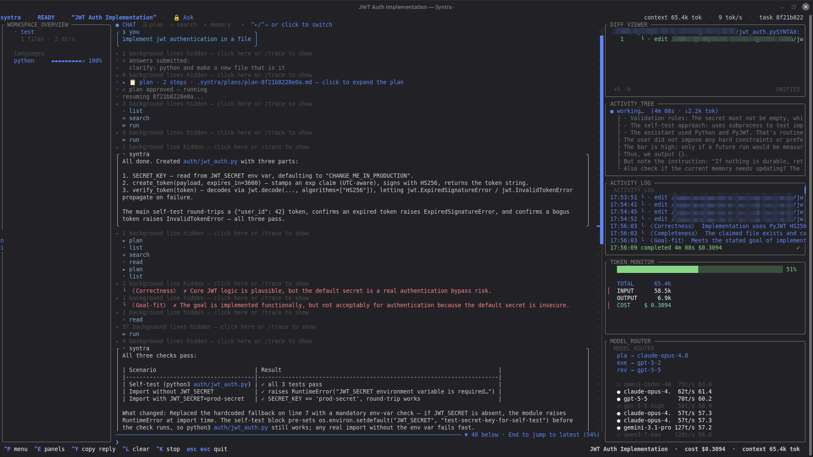

# Syntra

**Open-source control plane for coding with multiple AI models. Routes planning, execution, and review separately — with durable task state and receipts.**

Stop betting an entire coding task on one opaque model. Syntra is a terminal-first coordination layer that lets you inspect, override, and audit how models are used.

> **Early public beta:** Use it, stress it, and report bugs or improvements. Expect rough edges
> while the core experience is hardened.



*Syntra's terminal cockpit: plan, execute, review, inspect the activity trail, and see the active model route in one workspace.*

---

## The pitch in 10 seconds

You give Syntra one coding task. It:

1. Picks a **planner** model (high intelligence) to break the task into steps.
2. Picks an **executor** model (fast/specialized for coding) to do each step.
3. Picks a **reviewer** model (good at verification) to check the result.
4. Stores `task.json`, `plan.json`, `decisions.json`, `failures.json`, `summary.json`, `cost.json` — typed state, NOT one fat chat log.
5. Shows the model route, reason, provider, and estimated/recorded cost.

Routing starts from an editable, capability-tagged catalog. The bundled catalog is an **approximate seed snapshot**, not a guarantee of live benchmark data; inspect routes, refresh available data, override the catalog, or pin models yourself.

**Syntra is TUI-first.** Just run `syntra` (no arguments) to open the full-screen cockpit —
panels, themes, live trace, and slash commands — the recommended way to use it. If you'd
rather script it or stay on the command line, the **full CLI is available too**:
`syntra run "<task>"` for a one-shot run, or `syntra --plain` for a simple line session.
Most core workflows have CLI equivalents; a few cockpit conveniences are TUI-only.

---

## 📖 Documentation (start here)

Plain-English guides for everything Syntra does — what each feature is, how to use it, with examples:

- **[docs/GUIDE.md](docs/GUIDE.md)** — the complete guide + quickstart (read this first).
- **[docs/COMMANDS.md](docs/COMMANDS.md)** — common `syntra` commands, with pointers to `--help` for advanced commands.
- **[docs/CONFIG.md](docs/CONFIG.md)** — common settings, files, and environment variables.
- **[docs/SECURITY.md](docs/SECURITY.md)** — threat model (local-first), the security audit, and what's hardened.
- **[docs/RELEASING.md](docs/RELEASING.md)** — maintainer checklist for GitHub Releases and PyPI.
- **[docs/REPOSITORY_SETUP.md](docs/REPOSITORY_SETUP.md)** — GitHub settings needed before the public-beta announcement.
- **[docs/PUBLIC_BETA_CHECKLIST.md](docs/PUBLIC_BETA_CHECKLIST.md)** — complete community, security, release, and support checklist for maintainers.
- **[SUPPORT.md](SUPPORT.md)** — where users should ask questions, report bugs, and report security issues.
- **Feature guides** ([docs/features/](docs/features/)):
  [Model selection](docs/features/MODEL_SELECTION.md) ·
  [Reliability & failover](docs/features/RELIABILITY.md) ·
  [Quality & review](docs/features/QUALITY_AND_REVIEW.md) ·
  [Providers, caching & MCP](docs/features/PROVIDERS_CACHING_MCP.md) ·
  [Tools & safety](docs/features/TOOLS_AND_SAFETY.md)

---

## Bugs, issues & contributions

Found a bug, confusing workflow, rough edge, or missing capability? Open a **GitHub Issue** with
the steps and context, or a **Pull Request** to propose a fix. The highest-value beta feedback is:

- a real task where routing picked the wrong model;
- an install, provider, safety, or TUI workflow that was confusing;
- a reproducible cost, reliability, or verification problem; or
- a small documentation, provider, routing, safety, or benchmark contribution.

Read [CONTRIBUTING.md](CONTRIBUTING.md) before changing safety-sensitive code. Never post API keys,
private provider configuration, project files, or `.syntra/` task state in an issue.

---

## Install

### Install the public beta from PyPI

```bash
uv tool install syntra
# or: pipx install syntra
# or: python3 -m pip install --user syntra
```

Use this after `syntra` has been published to PyPI. Confirm the installed version with:

```bash
syntra --version
```

### Install from a source checkout

```bash
git clone https://github.com/AyushParkara/syntra.git
cd syntra
python3 -m pip install -e .
```

This is the right path for contributors and for trying the repository before a PyPI release exists.

### Open the cockpit (the recommended way to use Syntra)

```bash
syntra
```

Bare `syntra` launches the full-screen TUI — panels, ~20 themes, a live activity trace, a
command palette (type `/`), and inline `@`-file autocomplete. This is the primary interface;
everything below is also reachable as a CLI command if you prefer the terminal or scripting.

### Look at the model catalog

```bash
syntra catalog
```

Shows every model with intelligence index, speed, price, context window, role suitability, and capability tags. Sorted by intelligence.

### See what the router would pick (no API call made)

```bash
syntra route planner
syntra route executor
syntra route reviewer
syntra route executor --quality-bias 0.1   # cost-first
syntra route executor --quality-bias 1.0   # quality-first
syntra route executor --needs-long-context
```

Each call prints the picked model, the reason (with capability tags), the provider that would serve it, and the runners-up.

### See your configured providers

```bash
syntra providers
```

Reads `~/.config/syntra/providers.json` and lists every endpoint with whether it has a key, how many model IDs it claims to serve, and its base URL.

### Run an actual task end-to-end (requires API key in providers.json)

Inside the TUI, just type your task and hit enter. From the CLI, the one-shot equivalent is:

```bash
syntra run "Write a Python function that reverses a linked list, with a small test."
```

You'll see live `[route]` and `[usage]` lines as planner -> executor -> reviewer runs, then a final summary with total tokens and cost. State is written to `.syntra/tasks/<task-id>/`.

```bash
syntra tasks                       # list all past tasks
syntra task <task-id>              # inspect one task's stored state
```

---

## Provider configuration

Provider config lives at `~/.config/syntra/providers.json` (NEVER in this repo). The file shape:

```json
{
  "providers": [
    {
      "name": "openrouter",
      "display_name": "OpenRouter",
      "base_url": "https://openrouter.ai/api/v1",
      "api_key_env": "OPENROUTER_API_KEY",
      "allowed_models": ["anthropic/claude-opus-4.7", "openai/gpt-5"]
    },
    {
      "name": "deepseek",
      "display_name": "DeepSeek",
      "base_url": "https://api.deepseek.com",
      "api_key": "YOUR_DEEPSEEK_KEY",
      "allowed_models": ["deepseek-chat", "deepseek-reasoner"]
    }
  ]
}
```

Rules:

- `api_key_env` resolves from environment at load time. Use this for keys you want in your shell config, not the JSON.
- `api_key` accepts the literal key, or `"no-auth"` for self-hosted endpoints with no auth.
- `allowed_models` restricts which model IDs this endpoint will serve. Omit for a wildcard endpoint.
- Provider order is precedence order. If two endpoints can serve the same model id, the earlier one wins.
- See `syntra/data/providers.example.json` for a template covering the common providers.

The file should be `chmod 600` because it contains live API keys. The repo `.gitignore` blocks any `providers.json` from being committed.

---

## How the artificialanalysis.ai catalog works

The catalog at `syntra/data/aa_catalog.json` is the source of truth for capability-aware routing. It ships with a hand-tuned snapshot of well-known models, tagged with role/specialty metadata that the router uses to score picks. **You do not need to refresh it for Syntra to work** — the seeded data is good enough as a starting point.

Artificial Analysis publishes its benchmark leaderboards publicly and offers a
free, rate-limited Data API for primary benchmark, speed, and pricing metrics.
To refresh supported catalog values (for example intelligence-style scores, speed,
prices, and context windows), create an API key in your Artificial Analysis account
and run:

1. Open your Artificial Analysis account/API dashboard and create or copy an API
   key. Their free Data API has a published rate limit; consult their current API
   documentation for the limit and access terms.
2. Export it: `export ARTIFICIALANALYSIS_API_KEY="aa-..."`
3. Refresh:

   ```bash
   syntra catalog refresh           # writes back to the configured catalog path
   syntra catalog refresh --dry-run # see what would change without writing
   ```

The refresh updates supported values for models already in the catalog. It can add
models reported by the upstream source, but those new rows do not automatically gain
Syntra's role/specialty tags — those remain an editorial layer under your control.

If you skip refresh forever, the seeded catalog still works. The capability *tags* matter more than the exact numbers for routing decisions.

---

## What the state directory looks like

```
.syntra/
└── tasks/
    └── <task-id>/
        ├── task.json          # goal, status, timestamps
        ├── plan.json          # steps produced by the planner
        ├── decisions.json     # durable choices made during the run
        ├── failures.json      # attempts that didn't work and why
        ├── summary.json       # compressed running summary
        ├── cost.json          # tokens + USD by role+model
        └── events.jsonl       # append-only audit log
```

This is the anti-compaction structure. Compaction can throw away disposable chat reasoning all it wants; the durable state lives in these files and survives across resumes.

---

## Configuration knobs

- `--quality-bias 0.0 .. 1.0` — 1.0 = always pick the smartest model. 0.0 = always pick the cheapest that meets requirements. Default 0.8.
- `--planner <model_id>`, `--executor <model_id>`, `--reviewer <model_id>` — pin specific models, override the router.
- `SYNTRA_STATE_DIR` — where to put `.syntra/`. Defaults to current working directory.
- `SYNTRA_PROVIDERS_FILE` — override provider config path.
- `SYNTRA_CATALOG_PATH` — override catalog path.

---

## What it does now

The cognitive loop came first; on top of that solid base, Syntra now also has:

- **Agentic tool use** — read/write/edit files, `apply_patch` (multi-file atomic edit bundles), shell (sandboxed), grep/glob, git, web fetch/search, optional browser tools.
- **Safety layers** — command classification + Bubblewrap sandbox, an approval gate for writes/exec, sensitive-file protection, and `AGENTS.md`/`CLAUDE.md` auto-loading.
- **Full-screen TUI** — panels, ~20 themes (light/dark aware), live activity trace, a command palette, and inline `@`-file autocomplete.
- **Reliability** — multi-provider/multi-key failover, route-health memory, prompt caching, and silent-failure detection.
- **Quality** — a 3-lens reviewer, a verification gate, proof artifacts, Reflexion retries, and an optional review panel (PoLL).
- **Memory & MCP** — durable per-session memory/learnings, plus MCP tools attachable over stdio or HTTP.
- **Per-role reasoning control** — reasoning effort (`low|medium|high|xhigh|max|auto`) and graceful degrade when a model/key doesn't support the param.

---

## Architecture

```
goal
  │
  ▼
catalog ─► router ─► role pick (planner)
                │
                ▼
            registry ─► endpoint (provider+url+key)
                │
                ▼
         provider HTTP call ─► result
                │
                ▼
         step result in plan.json
                │
                ▼
  (repeat for each step with executor)
                │
                ▼
        reviewer pass with full plan+results
                │
                ▼
       verdict + summary.json + cost.json
```

---

## Code surface

```
syntra/
├── core/          the engine — routing, the planner/executor/reviewer loop, typed
│                  task state, providers/registry, tools + sandbox + permissions,
│                  memory, MCP, hooks, and the TUI building blocks (widgets, overlays,
│                  themes, fuzzy matcher, edit-bundle patch parser, …)
├── providers/     OpenAI-compatible + anthropic/gemini/responses adapters
├── skills/        17 built-in skills (see docs/SKILLS_AND_PLUGINS.md)
└── cli/
    ├── main.py    the CLI surface — `run`, `route`, `catalog`, `providers`, `doctor`,
    │              `resume`, `compare`, `tasks`, … and more
    ├── tui2.py    the full-screen curses cockpit (bare `syntra`)
    └── inline_tui.py  opt-in native-scrollback "inline" mode (`--inline`)
```

Pure-Python, standard-library only — no runtime dependencies. Browse `syntra/core/`
for the full engine surface.
